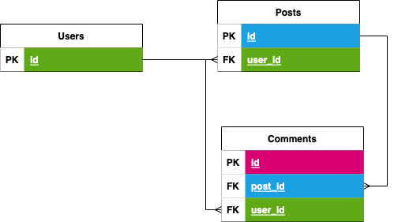

#  RESTful API Planning

---

## What is REST?

`REST` is an acronym for *_representational state transfer_*, and it describes a software architechure pattern that was created to solve software engineering issues presented by the world wide web. `REST` describes how an API should behave in order to maintain scalability, uniformity and backwards compatibilty. Essentially, `REST` is a set of rules that if you follow, your web application's backed will be free of extremely complex and otherwise difficult to avoid bugs! You just need to learn the rules of a `RESTful API`, and how to apply them.

The simple English Wikipedia [used to have](https://simple.wikipedia.org/w/index.php?title=Representational_state_transfer&oldid=7415343) some really great non technical exmaples of `RESTful` systems. Lets read them now:

> Representational state transfer (REST) is a programming architectural implementation intended to increase the efficiency of communication in computing systems. It embodies the idea that the best way to share large amounts of data between multiple parties is to make that data available on-demand by sharing references to that data rather than a complete copy of the data itself. Systems which implement REST are called 'RESTful' systems. 

> An example of a non-RESTful real-world system would be the traditional home movie collection. In order to have access to any given movie, the library owner must obtain a physical copy of it. This results in substantial waste as more copies are in existence than are in use at any given moment. Also, the time required to add new titles to the library is generally non-trivial. Streaming video is the RESTful counterpart to the home library. Instead of having a complete copy of every movie stored in the home, the movie is referred to by its title only and the content of the movie is streamed on demand. 

> The World Wide Web is the largest example of a RESTful system today. Physical libraries are its non-RESTful equivalent. Instead of sending a physical electronic copy of every digital resource to each person or library, we assign each resource a URL identifier "http://example.com", then access the actual content via the Internet rather than retrieving a local copy from an optical disk or a hard drive. 

## Reading Preparation

Read through the following links:

* [REST API Quick Tips](https://restapitutorial.com/lessons/restquicktips.html)
* [Using HTTP Methods](https://restapitutorial.com/lessons/httpmethods.html) for RESTful Services
* [Resource Naming](https://restapitutorial.com/lessons/restfulresourcenaming.html)

And keep the following in mind: `REST` is a based on resources and actions that can be taken on them. Practiaclly what this means for us a _*resource*_ is a dataabase `model` or `table`, an _*action*_ is a database [CRUD](https://en.wikipedia.org/wiki/Create,_read,_update_and_delete) action, and _*URIs*_ are routes.

## How DB Models Relate to Routes in REST

Here is the [ERD]() for a simple blog-style social media application:

One `user` can have many `posts`. `Users`:`Posts` are **1:M**

One `post` can have many `comments`. `Posts`:`Comments` are **1:M**

## REST api template

## Activity: Planning a `REST API`

---

## Licensing
1. All content is licensed under a CC-BY-NC-SA 4.0 license.
2. All software code is licensed under GNU GPLv3. For commercial use or alternative licensing, please contact legal@ga.co.
